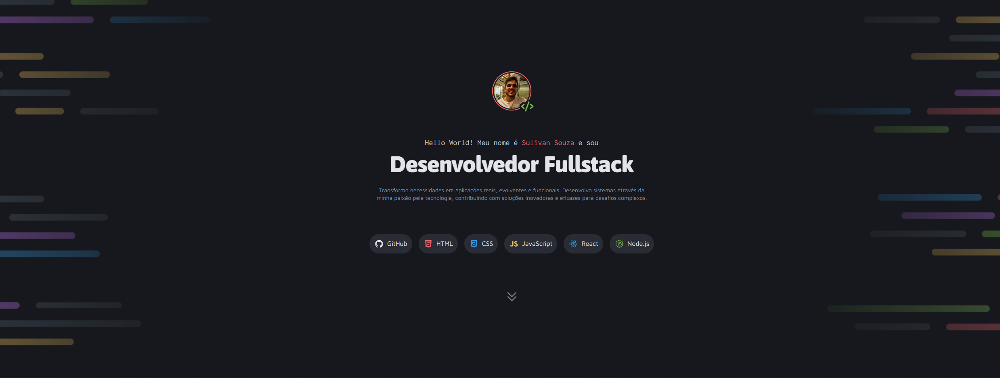

# Portfólio Dev

Uma página responsiva desenvolvida com **HTML5** e **CSS3**, apresentando minha identidade como desenvolvedor, principais tecnologias, projetos em destaque e formas de contato. O projeto foi desenvolvido com base em um layout disponibilizado pela **Rocketseat** no Figma Community.

## Tecnologias

- HTML5
- CSS3

## Funcionalidades

- Layout moderno e responsivo
- Estrutura semântica em HTML
- Organização do CSS em arquivos separados
- Tags de tecnologias na apresentação
- Cards de projetos com imagem, título e descrição
- Cards de serviços
- Botões de contato com estados de hover e foco
- Favicon próprio em SVG

## O que aprendi

Durante o desenvolvimento deste projeto pratiquei:

- Estruturação semântica com elementos como `section`, `h1`–`h3`, `a` e `img`
- Organização do CSS utilizando múltiplos arquivos com `@import`
- Uso de variáveis CSS (`:root`) para cores, fontes e escalas de tipografia
- Aninhamento nativo de CSS espelhando a estrutura do HTML
- Especificidade e cascata: por que um seletor de seção sobrepõe um componente
- Separação entre utilitários, componentes e estilos de seção
- Alinhamento e espaçamento com **Flexbox** e **Grid**
- Responsividade com `clamp()`, `min()` e `auto-fit`, reduzindo a necessidade de media queries
- SVG inline com `currentColor` para trocar a cor de ícones via CSS
- Acessibilidade: `:focus-visible`, `alt` descritivo e `aria-hidden` em ícones decorativos

## Layout

O design utilizado neste projeto está disponível no Figma:
🔗 <https://www.figma.com/community/file/1387080701963671866/portfolio-dev>

## Como executar

- Abra o arquivo `index.html` no navegador.
